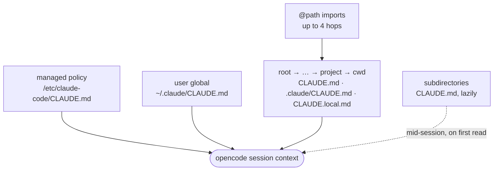

# CLAUDE.md for opencode


[](https://www.npmjs.com/package/opencode-claude-md)
[](https://www.npmjs.com/package/opencode-claude-md)
[](LICENSE)
[](https://opencode.ai/docs/plugins/)

> **If Claude Code would read your `CLAUDE.md`, opencode reads it too.**

[opencode](https://opencode.ai) reads `CLAUDE.md` natively, but stops at the closest match. This plugin loads everything else Claude Code would, all the way up the tree.

Move a project between Claude Code and opencode and your instructions follow: no half-loaded memory, no silent gaps.

<br clear="all">

## Features

- 📚 **Full hierarchy** from filesystem root down to your working directory, ancestors first
- 🌐 **User-global and managed-policy** files, on every OS
- 🔒 **`CLAUDE.local.md`** picked up at every level
- 🔗 **`@path` imports** expanded up to 4 hops deep
- 🪺 **Subdirectory `CLAUDE.md`** loaded lazily, as tools reach into each subtree
- ♻️ **Deduped** against opencode's own pick, so nothing lands in context twice
- 🪶 **One file, zero runtime dependencies** (`index.ts`)

## What gets loaded

opencode walks up from your working directory and takes the first `AGENTS.md` or `CLAUDE.md` it finds, then stops. This plugin stacks everything else around that pick.

| Instruction source | opencode native | opencode-claude-md |
|---|:---:|:---:|
| Closest `AGENTS.md` / `CLAUDE.md` to cwd | ✅ | ✅ *(left to opencode)* |
| One global file | ✅ | ✅ |
| Every `CLAUDE.md` from root → cwd | ❌ | ✅ |
| `.claude/CLAUDE.md` at each level | ❌ | ✅ |
| `CLAUDE.local.md` at each level | ❌ | ✅ |
| `@path/to/file` imports (≤ 4 hops) | ❌ | ✅ |
| Managed policy file (per-OS path) | ❌ | ✅ |
| Subdirectory `CLAUDE.md`, on first touch | ❌ | ✅ |



## Installation

Install globally, for every project:

```sh
opencode plugin opencode-claude-md@latest -g
```

Drop `-g` to install for the current project only, or add it to `opencode.json` yourself:

```json
{ "plugin": ["opencode-claude-md@latest"] }
```

## Usage

> [!TIP]
> Restart opencode after installing so the plugin loads.

Ask opencode what it can see, no tools needed:

```
list all CLAUDE.md / AGENTS.md that you can see right now (without using tools)
```


## How it works

Content injects once per session. It rides as a hidden `<system-reminder>` text part on your first message: the model sees it, the TUI does not. Per-file labels match Claude Code's ("project instructions, checked into the codebase", and so on).

Subdirectory files load later. When a tool reads, edits, or writes a file below your working directory, the plugin checks that path. Any new `CLAUDE.md` or `CLAUDE.local.md` it finds gets attached to the tool result, the way Claude Code delivers them.

After a `/compact`, startup files re-inject on the next message and subdirectory files re-attach on the next read.

<details>
<summary><b>Safety, dedup, and import rules</b></summary>

A plugin can't show approval dialogs, so two guards stand in:

- **Confined imports.** An `@import` resolves only if its real target lives under the worktree, or under the importing file's own directory. Paths resolve through `realpath`, so symlinks can't cheat. Claude Code gates external imports behind a dialog; this plugin refuses them instead.
- **Escaped tags.** Any `<system-reminder>` tag inside file content gets escaped, so an instruction file can't forge or close the wrapper.

Two more details:

- **No duplicates.** The plugin skips whatever opencode's native loader already picked up: its first-match `AGENTS.md` / `CLAUDE.md` / `CONTEXT.md`, plus the global pick. Nothing reaches the model twice. It still expands that file's `@path` imports, though, since opencode's loader never does.
- **Comments stripped.** HTML comments are removed before injection.
- **Imports ignore code.** `@path` references inside fenced blocks and inline code spans are left alone.

</details>

## Alternatives

| Option | What it covers | Gap |
|---|---|---|
| opencode [native rules](https://opencode.ai/docs/rules/) | One project file + one global file | No ancestor stacking, no `CLAUDE.local.md`, no `@import` |
| `instructions` array in `opencode.json` | Files you list by hand (globs, paths, URLs) | Maintained per project, ignores Claude Code's discovery rules |
| Symlink `AGENTS.md` → `CLAUDE.md` | One file per directory level | opencode still stops at the first match |
| [opencode-claude-memory](https://github.com/kuitos/opencode-claude-memory) | Shares Claude Code's auto-memory dir | Different layer (memory the model writes). Runs fine alongside this plugin |

## FAQ

### How do I load CLAUDE.md in opencode?

Out of the box, opencode reads a project `CLAUDE.md` only when no `AGENTS.md` exists, and only the closest one. Install this plugin to load the full hierarchy the way Claude Code does, at session start.

### Does opencode read AGENTS.md or CLAUDE.md first?

`AGENTS.md` wins natively; `CLAUDE.md` is the fallback. The plugin leaves that pick alone and stacks every other `CLAUDE.md` around it.

### Why isn't my `~/.claude/CLAUDE.md` injected by the plugin?

opencode already autoloads `~/.claude/CLAUDE.md` when `~/.config/opencode/AGENTS.md` doesn't exist. In that common setup the global file reaches the model through opencode, and the plugin skips its body to avoid a duplicate (it still expands the file's `@path` imports, which opencode ignores). The plugin injects the file itself only when `~/.config/opencode/AGENTS.md` exists and wins the native pick.

### Do `@path` imports in CLAUDE.md work in opencode?

Not natively. With this plugin they do: relative, absolute, and `~/` paths, up to 4 hops deep, same as Claude Code documents. Two conservative choices on top: imports inside code fences and inline spans are ignored, and targets outside the worktree (or the importing file's directory) are refused.

### Can instructions end up in the context twice?

No. The plugin replicates opencode's native pick and skips those files. It injects at most once per session, re-injecting only after compaction.

## Out of scope

- `.claude/rules/*.md` path-scoped rules.

## Development

The whole plugin is one file, `index.ts`, with no build step.

```sh
bun install
bunx tsc --noEmit
```

## Contributing

Issues and pull requests are welcome at [the repo](https://github.com/uwuclxdy/opencode-claude-md). Run `bunx tsc --noEmit` before opening a PR.

## License

MIT
